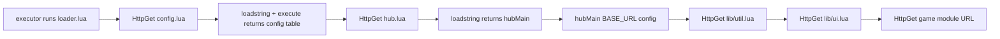

# Network architecture

## Static asset tree (primary)

All modular loading assumes a **plain HTTP** (or HTTPS) **static file** layout:

```
BASE_URL
├── config.lua
├── hub.lua
├── loader.lua
├── lib/util.lua
├── lib/ui.lua
├── lib/mya_combat_helpers.lua
├── games/...
└── universal/dumper.lua
```

No REST API in-repo: **each file is fetched by path** via **`game:HttpGet`**.

## Request flow (raw loader)



## Junkie overlay

Junkie’s CDN serves **`loader_jnkie.lua`** only. That script adds **one more hop**:

1. Optional key UI + SDK fetch from **`jnkie.com/sdk/library.lua`**.
2. HttpGet **`MYA_BASE_URL + "loader.lua"`** → then same as raw loader from step above.

## Third-party URLs

- **Junkie SDK:** `https://jnkie.com/sdk/library.lua` (when validation enabled).
- **Default `MYA_BASE_URL` in `loader_jnkie.lua`:** points at a **GitHub raw** tree; replace with your fork’s raw root.

## Failure modes

- **404** on any path → compile or load error surfaced in **`MyaLoaderError`** or hub **`notify`**.
- **HTTP blocked** by executor → user must allow HTTP or use a different executor policy.
- **Mixed content / TLS** issues are rare in Roblox client but depend on Roblox’s HttpService rules.

## Caching

There is **no cache layer** in Mya; every run re-fetches sources unless the executor or Roblox layer caches transparently. For fast iteration, bump branch or use cache-busting only if you add it yourself (not in core files today).
